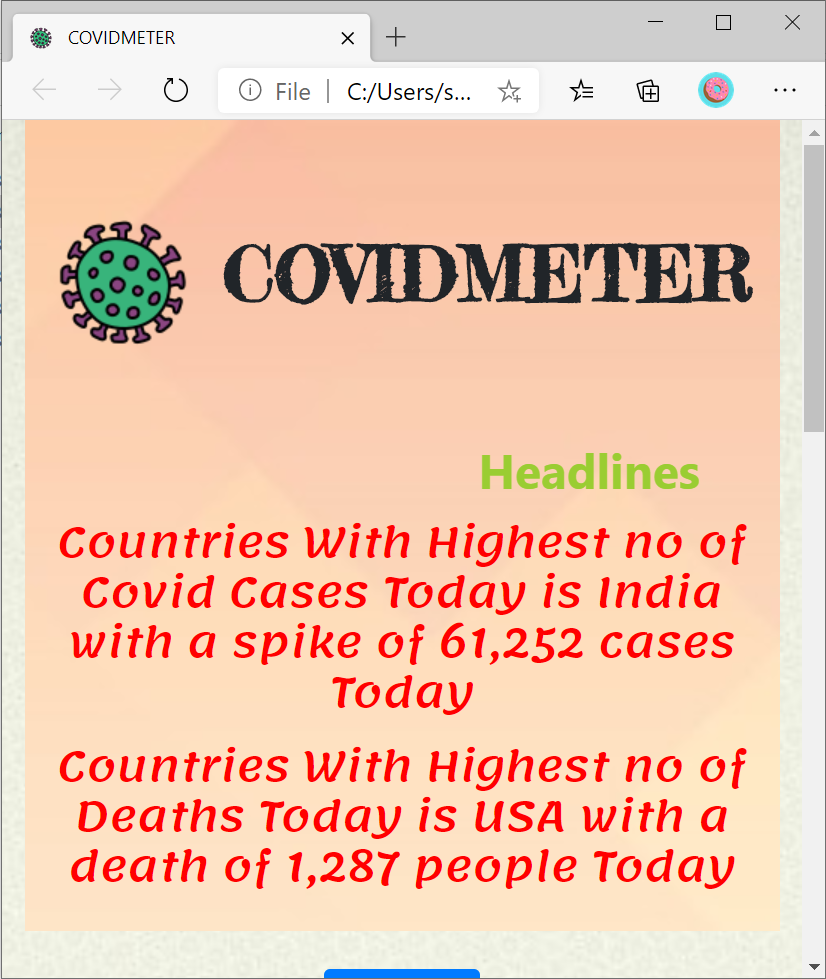

# CovidMeter
Developed a Real time web applications that tracks  
<ul>
  <li>Covid-19 cases</li>
  <li>Recovery Rate</li>
  <li>fatality</li>
  <li>new Cases</li>
</ul>

Applied the knowledge of HTML CSS Javascript and Jquery

